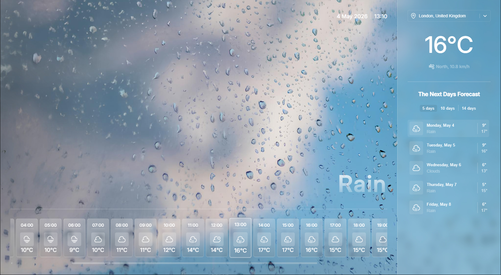
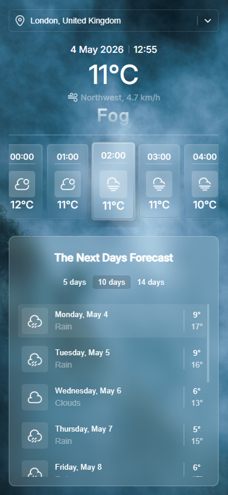
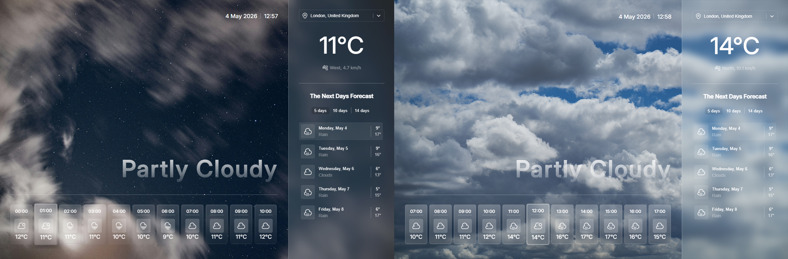
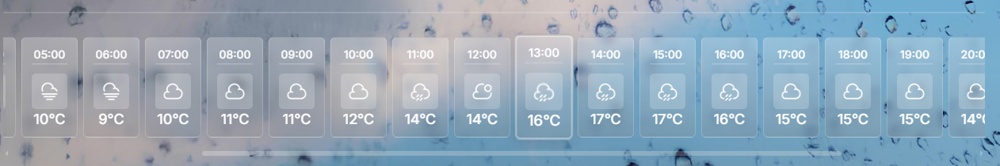
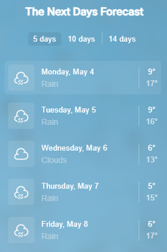

# Weather Forecast App

A responsive weather application built with React + Vite.

## Tech Stack

- React
- Vite
- SCSS (Sass)
- Vitest (unit testing)
- Weather API (WeatherAPI.com)

## Requirements

- Node.js (LTS recommended, >= 20)
- npm (comes with Node.js)

## What this project does

- Shows current weather and hourly forecast for the selected city.
- Shows multi-day forecast with tabs (`5 / 10 / 14 days`).
- Supports city search with suggestions.
- Updates local time based on the selected location timezone.
- Dynamically changes visual theme/background based on weather condition and day/night.
- Includes responsive layouts for desktop and mobile.

## Run locally

1. Install dependencies:

```bash
npm install
```

2. Create a `.env` file in the project root and add:

```env
VITE_WEATHER_API_KEY=your_api_key_here
```

3. Start development server:

```bash
npm run dev
```

4. Optional checks:

```bash
npm run lint
npm run build
npm run preview
```

## Testing

The project includes basic unit tests using Vitest.

Tested parts:
- utility functions (weather normalization, time calculations)
- theme resolution logic
- custom React hooks (`useForecastTabs`)

Run tests:

```bash
npm run test
```

## Architecture decisions

### UI structure

- `App.jsx` orchestrates page composition and passes data to feature components.
- Weather UI is split into focused components:
  - `SidebarTopContent` (search + current metrics)
  - `HourlyForecast` (hourly cards)
  - `Sidebar` + `DailyList` (next-days forecast)

### Data and state hooks

- `useWeather` handles API requests, loading/error states, city input, and suggestions.
- `useClock` provides ticking time for location-aware clock rendering.
- `useForecastTabs` controls forecast range and active day.
- `useWeatherTheme` derives theme + weather label + day/night mode from active weather data.

### Utility-first weather logic

- Mapping and normalization are moved into `utils/*` and `constants/weatherThemes.js`.
- This keeps rendering components smaller and easier to maintain.

### Styling strategy

- SCSS is split by concern:
  - `styles/abstracts` (variables, mixins)
  - `styles/base` (typography, responsive)
  - `styles/components` (feature styles)
  - `styles/themes` (day/night visual behavior)

## Design screenshots

```md





```

## Key implementation notes

- **Active hour synchronization**
  - The application automatically selects the current hour based on the location's local time (`location.localtime`).
  - This ensures the UI reflects real-world conditions immediately after data load without requiring user interaction.

- **State-driven UI architecture**
  - UI is derived from a minimal set of state variables (`weatherData`, `activeDay`, `activeHour`).
  - Forecast navigation updates both hourly and sidebar data, keeping all sections synchronized.

- **Weather data processing & theming**
  - API weather conditions are normalized into a limited internal set (`rain`, `cloudy`, `clear`, etc.).
  - A configuration-based theme system maps weather types to UI variants (day/night).
  - Business logic is separated from UI via hooks and utility functions.

- **Forecast navigation model**
  - Selecting a day updates the hourly forecast dataset and resets the active hour.
  - Sidebar data is always derived from the currently active hour within the selected day.
  - This ensures consistent synchronization across all UI sections.

- **Responsive layout trade-offs**
  - Some SCSS nesting was preserved to maintain predictable overrides between desktop and mobile styles.
  - In certain cases, readability and stability were prioritized over strict DRY principles.

- **Progressive enhancement approach**
  - Core functionality (data fetching + rendering) was implemented first.
  - Visual enhancements (glass UI, transitions, dynamic backgrounds) were layered on top afterward.
